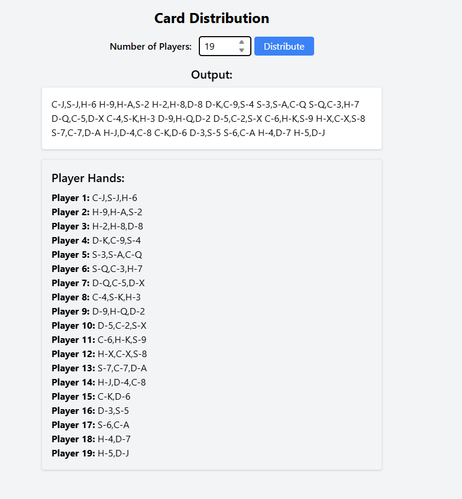

# kevinchoo-cardgame
My PHP & Jquery Card Game as well as Optimized SQL

## Part A
## Description
This is a PHP + jQuery web application for the assignment, containerized using Docker.
The environment includes:
- PHP 8.2 with Apache
- jQuery (included via CDN)
- tailwind.css (included via CDN)
- All code is in the `src/` folder

## How To Run

### Prerequisites
- Docker Desktop installed on your machine

### Steps
1. Clone or Download This Repository
2. Start Docker via `docker-compose up --build`
3. Open Local Browser to access Webpage via http://localhost:8080

##AI Tools Used
This project was developed with the support of ChatGPT. The AI was used to assist with specific parts of the project:
  - **Front-end UI (Tailwind CSS)**: ChatGPT helped generate and structure the HTML and Tailwind classes to speed up building the user interface.  
  - **Docker setup**: ChatGPT provided guidance and generated the `Dockerfile` and `docker-compose.yml` configuration for running PHP, HTML, and CSS files inside Docker.  
  - **PHP helper suggestions**: ChatGPT suggested functions and small code improvements to make the PHP code more readable and maintainable.  
  - **README documentation**: ChatGPT helped clean up and structure the README file to make the instructions clearer and more professional.

## App Screenshot
Here is how the app looks in the browser:

